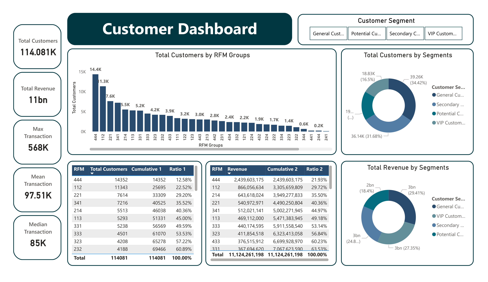

# 🧩 Customer Segmentation – Python & Power BI

This project focuses on analyzing customer behavior and segmenting them based on Recency, Frequency, and Monetary (RFM) values. It combines Python for data preprocessing and segmentation logic, and Power BI for data visualization and stakeholder presentation.

---

## 🧠 Project Objectives

- Identify high-value and at-risk customer groups
- Provide actionable insights for retention and marketing strategy
- Visualize key patterns and performance by customer group

---

## 🛠️ Workflow Summary

1. **Data Preparation**: Cleaned transaction and customer data using Python (Pandas)
2. **RFM Segmentation**: Calculated Recency, Frequency, Monetary values
3. **Scoring & Grouping**: Used RFM scores to segment into strategic groups
4. **Visualization**: Built interactive dashboard using Power BI

---

## 📊 Visual Preview

---

## 📁 Project Structure

| File / Folder | Description |
|---------------|-------------|
| `customer_segmentation.ipynb` | Main analysis notebook with RFM logic |
| `data/` | Raw and cleaned customer transaction data |
| `visualization/Dashboard.png` | Power BI dashboard preview |
| `visualization/` | Folder to store visuals and `.pbix` (if any) |
| `README.md` | Project overview and documentation |

---

## 🧰 Technologies Used

- **Python**: Pandas, NumPy, Seaborn, Matplotlib
- **Power BI**: RFM dashboard visualization
- **GitHub**: Collaboration and version control

---

## 📬 Contact

📧 huong.nguyen@email.com  
💼 [LinkedIn](https://www.linkedin.com/in/yourprofile)

---
